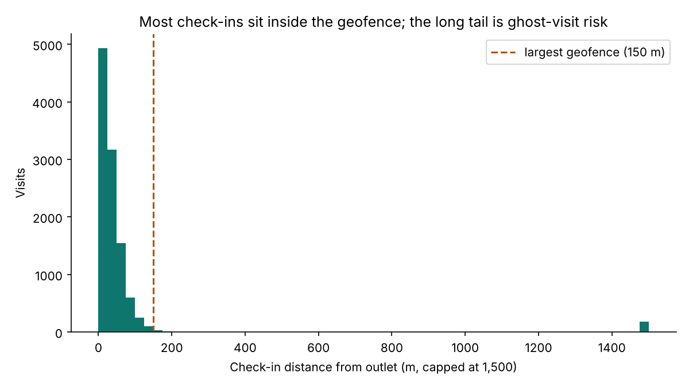
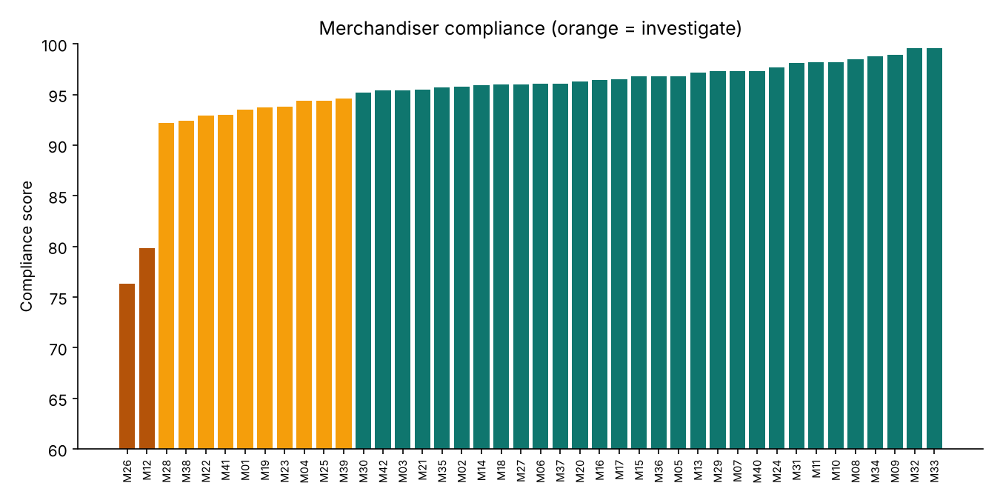

# Field Force Analytics — GPS visit verification, ghost-visit detection & FIFO freshness alerts

The analytics engine behind **MerchTrack V2**, a field force automation platform I architected. It now covers every retail outlet in Kenya and is used daily by 40+ merchandisers and 6 managers. In production it helped **lift sales 15%**, **cut product returns 30%**, and **bring short-supply incidents to zero**.

> **Data note:** this repo runs on **synthetic outlets, visits and stock batches** from `generate_data.py`. Ghost visits are planted on purpose so the checks have something to catch. Platform source: [MerchTrack](https://github.com/OKUMUKOKUMU/MerchTrack).

## Verification logic

| Check | Rule |
|---|---|
| **Geofence** | Haversine distance from check-in to outlet > outlet geofence radius (75–150 m) |
| **Duration** | Visit shorter than 10 minutes |
| **Evidence** | Fewer than 2 shelf photos |
| **Sign-off** | No digital manager sign-off |
| **Ghost visit** | Fails geofence, **or** fails 2+ of the other checks |

Each merchandiser gets a **compliance score** (100 × share of clean visits) and a status of *Good*, *Coach* or *Investigate*.

The **Freshness Ledger** ranks the batches on shelf for each outlet and SKU by receipt date (FIFO), then raises one of three alerts: `EXPIRED`, `NEAR EXPIRY` (≤5 days) or `FIFO – oldest batch to front`.

## Sample run

```
Visits checked:        10,906
Probable ghost visits:    515 (4.7%)
Merchandisers to investigate: 2
Freshness alerts: 315 expired · 110 near expiry · 133 FIFO rotations
```




## Run it

```bash
pip install -r requirements.txt
python generate_data.py    # 225 outlets in 6 towns, 42 merchandisers, ~11k visits
python verify_visits.py    # -> outputs/flagged_visits.csv, merchandiser_compliance.csv, freshness_alerts.csv
```

## Beyond this repo (production platform)

- Offline-first chunked background sync for 1,000+ SKUs in low-connectivity outlets
- AI planogram compliance: SKU facings and shelf share read from shelf photos
- AI GRN digitisation: return data pulled from photographed receipts
- Executive briefings on route coverage, task velocity and field hours

**Stack:** Python · pandas · NumPy · matplotlib · (prod: TypeScript, GPS geofencing, computer vision)
